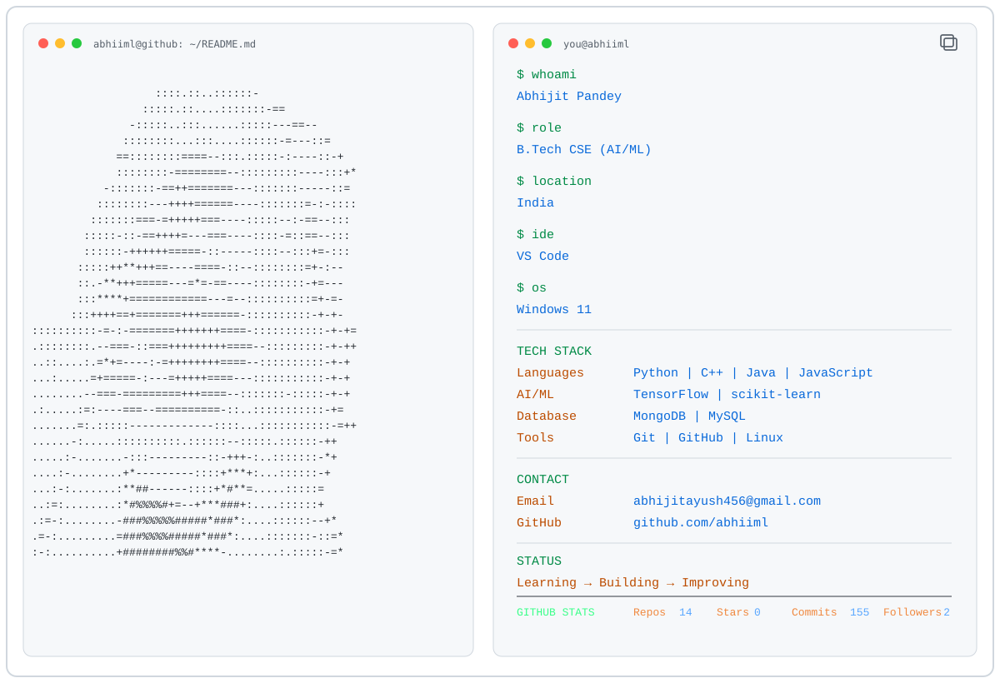

<a href="https://github.com/abhiiml/abhiiml">
  <picture>
    <source media="(prefers-color-scheme: dark)" srcset="./dark_mode.svg">
    
  </picture>
</a>

<h2>🐍 Contribution Snake</h2>

  <picture>
    <source
      media="(prefers-color-scheme: dark)"
      srcset="https://raw.githubusercontent.com/abhiiml/abhiiml/main/assets/github-contribution-grid-snake-dark.svg"
    />
    <source
      media="(prefers-color-scheme: light)"
      srcset="https://raw.githubusercontent.com/abhiiml/abhiiml/main/assets/github-contribution-grid-snake.svg"
    />
    
  </picture>

