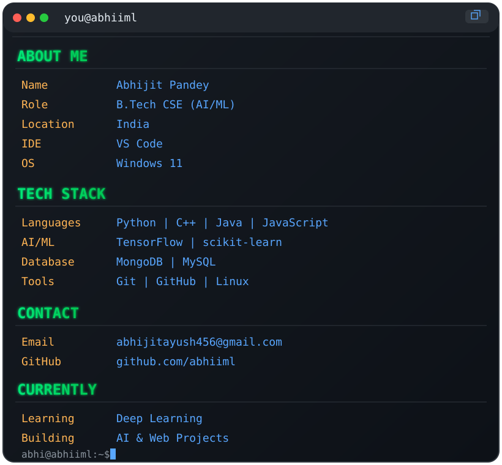

<p align="center">
  
</p>

<table width="100%">
<tr>

<td width="50%" valign="top">

```ansi
                   ::::.::..::::::-               
                 :::::.::....:::::::-==           
               -:::::..:::......:::::---==--      
              ::::::::...:::....::::::-=---::=    
             ==::::::::====--:::.:::::-:----::-+  
             ::::::::-========--:::::::::----:::+*
           -:::::::-==++=======---:::::::-----:::=
          ::::::::---++++======----:::::::=-:-::::
          :::::::===-=+++++===----:::::--:-==--:::
         :::::-::-==++++=---===----::::-=::==--:::
         ::::::-++++++=====-::-----::::--:::+=-:::
         :::::++**+++==----====-::--::::::::=+-:--
         ::.-**+++=====---=*=-==----::::::::-+=---
         :::****+============---=--::::::::::=+-=-
        :::++++==+=======+++======-::::::::::-+-+-
::::::::::-=-:-=======+++++++====-:::::::::::-+-+=
.::::::::.--===-::===+++++++++====--:::::::::-+-++
..::....:.=*+=----:-=++++++++====--::::::::::-+-+ 
...:.....=+=====-:---=+++++====---:::::::::::-+-+ 
........--===-=========+++====--:::::::-:::::-+-+ 
.:.....:=:----===--==========-::..:::::::::::-+=  
.......=:.:::::-------------::::...:::::::::-=++  
......-:.....::::::::::.::::::--:::::.::::::-++   
.....:-.......-:::---------::-+++-:..:::::::-*+   
....:-........+*---------::::+***+:...::::::-+    
...:-:.......:**##------::::+*#**=.....:::::=     
..:=:........:*#%%%%#+=--+***###+:....::::::+     
.:=-:........-###%%%%%#####*###*:....::::::--+*   
.=-:.........=###%%%%#####*###*:....:::::::-::=*  
:-:..........+########%%#****-........:.:::::-=*  
```


</td>

<td width="50%" valign="top">



</td>

</tr>
</table>

<br>

<p align="center">


</p>

<br>

<p align="center">


</p>

<br>

<p align="center">


</p>
